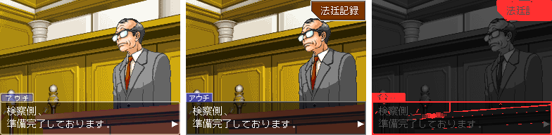
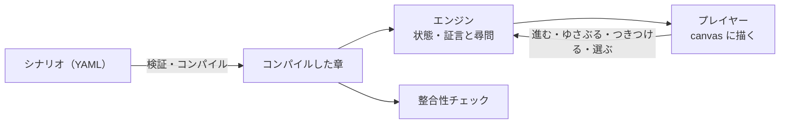

# Ace Attorney Script Editor

逆転裁判風の法廷アドベンチャーを作るための TypeScript フレームワーク。
シナリオは YAML で書き、ブラウザで遊べる。

画面は DS 版の上画面と同じ 4:3（256×192 ドット）。16:9 は将来の対応予定（試験的な実装がある。[画面](docs/screen.md)）。



左が DS 版、中がこのプレイヤー、右は違う画素を赤で塗ったもの。ほかの場面と一致率は
[DS 版との互換性](docs/compatibility.md)。画像の絵は「逆転裁判」シリーズ（© CAPCOM）のもの。

## 主な機能

- 会話・文中の演出（色・速さ・待ち・揺れ・フラッシュ・効果音）、日時・場所の表示、選択肢
- 証言・尋問（ゆさぶる・つきつける）、法廷記録（証拠品・人物ファイル）、ライフのゲージ、サイコ・ロック
- 探偵パート（調べる・移動・話す・つきつける）、横長の背景のスクロール、人物の指名・範囲を選ぶ遊び
- BGM・効果音・文字の音、セーブ・ロード
- エディタ AAEditor（フォームでの編集・検索・プレビュー・ここから再生・整合性チェック）
- 整合性チェック（詰み・クリアできない・たどり着かない所を見つける。TS 版と Rust 版）

元のゲームの機能ごとの対応状況（対応・近似・未対応）は [機能の対応状況](docs/compatibility.md#機能の対応状況)。
3D で調べる・指紋などの遊びは形を変えた近似で、マイクの「異議あり！」は無い。

## はじめかた

[Bun](https://bun.sh) を入れてから:

```bash
bun install
bun run dev    # プレイヤー（サンプル事件「時計塔の鐘」）とエディタを起動する。表示された URL を開く
```

自分の事件を作るなら [はじめてのシナリオ](docs/tutorial.md) から。



## ドキュメント

目的ごとの目次は [ドキュメント](docs/README.md)。

| したいこと | 読むもの |
|---|---|
| シナリオを書く | [はじめてのシナリオ](docs/tutorial.md)・[シナリオの書き方](docs/scenario.md)・[書き方の分析](docs/writing/README.md)・[人物の話し方](docs/characters/README.md) |
| エディタを使う | [エディタを使う](docs/README.md#エディタを使う) |
| 絵を用意する | [絵を用意する](docs/sprites.md) |
| 画面と DS 版との違いを知る | [画面](docs/screen.md)・[DS 版との互換性](docs/compatibility.md) |
| 開発する | [開発する](docs/development.md) |
| 公式の章を遊ぶ | [公式の章を遊ぶ](docs/official-chapters.md) |

## 構成

```text
.
├── packages/   エンジン（core）・YAML のコンパイラ（script）・描画と入力（runtime）
├── apps/       プレイヤー（player）・エディタ（editor）
├── crates/     整合性チェック（aa-verify）と ROM から取り出す道具（Rust）
├── tools/      変換・解析・ドット絵などの道具
├── schema/     エディタ補完用の JSON Schema
└── docs/       ドキュメント
```

詳しい構成は [開発する](docs/development.md#構成)。

## 公式の章を遊ぶ

Rust のツールを使って自分の ROM から取り出せば、元のゲームの章をオリジナルと同じように遊べる。
手順は [公式の章を遊ぶ](docs/official-chapters.md)。

このリポジトリは公式の台本・絵・音・フォントを配布しない。自分で吸い出した ROM を使い、取り出したものは手元でだけ使う。
