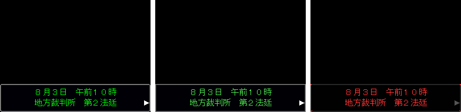
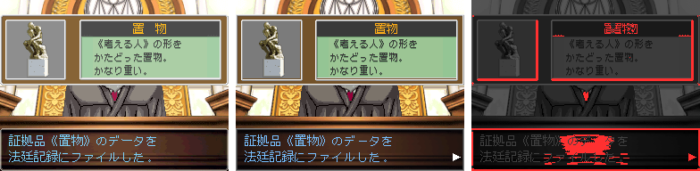
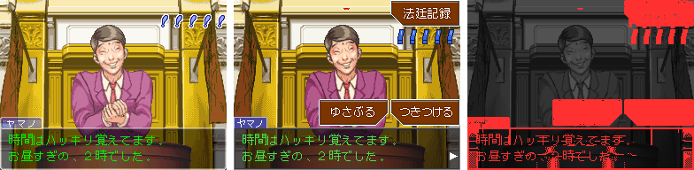
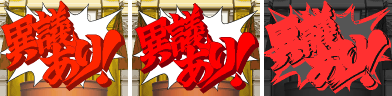
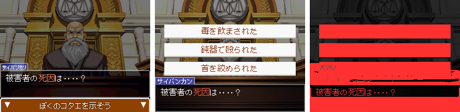

# DS 版との互換性

このプレイヤーが、元のゲーム（DS 版の「逆転裁判 蘇る逆転」「逆転裁判2」「逆転裁判3」）をどこまで再現できるか。
前半は見た目の比較、後半は機能ごとの対応状況と、このリポジトリ独自の機能。

## 見た目の比較

DS 版の上画面のスクリーンショットと、同じ場面をこのプレイヤーで描いたものを並べた。
左から **DS 版 | このプレイヤー | 違う所**（どれも等倍、256×192 ドット）。「違う所」は DS 版を暗くし、
RGB のどれかが 24 より大きく違う画素を赤で塗ったもの。

- **一致率**: 画面全体のうち、赤くない画素の割合。
- **黒以外**: どちらかが黒でない画素（RGB のどれかが 16 より大きい）だけで数えた一致率。
  黒い所が多い場面で、一致率が高く出すぎないようにするための値。

描いたのは蘇る逆転の第 1 話「はじめての逆転」を元の台本から変換した章で、絵・吹き出し・フォントは
手元の ROM から取り出した DS 版のもの（取り出し方は [README](../README.md#公式の章と素材手元用配布しない)）。
スクリーンショットのコマ（口の動き・揺れ・点滅）は分からないので、48 コマ撮って DS 版に最も近いコマを選んだ。

| 場面 | 一致率 | 黒以外 | 比較 |
| --- | ---: | ---: | --- |
| 会話（名札・文字） | 91.2% | 91.2% |  |
| 日時・場所の表示 | 98.3% | 59.6% |  |
| 証拠品の入手 | 92.4% | 92.1% |  |
| 尋問（証言） | 77.8% | 77.8% |  |
| 「異議あり！」 | 47.4% | 47.4% |  |
| 選択肢 | 44.7% | 43.3% |  |

違いの説明:

- **会話・証拠品の入手**: 背景・人物・証拠品の窓・文字は画素の単位でほぼ同じ。違うのは、右上の「法廷記録」ボタン
  （DS 版では下画面にある。1 画面にまとめたために上に出している）と、テキストウィンドウの枠・名札の縁の 1 ドットほどのずれ。
- **日時・場所の表示**: 文字の形と位置は同じ。文字の緑の色味が少し違うため、黒以外の一致率は 6 割ほどになる。
- **尋問**: 証言の文字（緑）・背景は同じ。違うのは「ゆさぶる」「つきつける」「法廷記録」のボタン（DS 版では下画面）と、
  右上のライフの印の位置（ボタンを避けて下にずらしている）。人物は、話している間の手の動きのコマが違う。
- **「異議あり！」**: 吹き出しの絵は同じ。DS 版のスクリーンショットは画面の揺れの途中で、吹き出しと背景が数ドットずれているため、
  一致率は低く出る。
- **選択肢**: 設計上の違い。DS 版は選択肢のボタンを下画面に出し、上画面は暗くして「ぼくのコタエを示そう」の帯を出し、
  テキストウィンドウを上にずらす。このプレイヤーは 1 画面にまとめるため、この上画面の作りをやめ、
  選択肢を画面の中央に並べている（問いかけの台詞はテキストウィンドウのまま）。背景と台詞の文字は同じ。

比較画像は `apps/player/compat-doc.html?shot=<名前>` で描ける（名前は `src/compat-doc.ts` の `SHOTS`。
手元に `assets/samples/ds/` のスクリーンショットと、取り出した DS 版の絵が要る）。ページのタイトルに 2 つの一致率が出る。

スクリーンショットの背景・人物・吹き出し・証拠品・文字は「逆転裁判」シリーズ（© CAPCOM）のもの。
互換性の説明のためにだけ載せている。このリポジトリは公式の画像・台本・音を配布しない。

## 機能の対応状況

蘇る逆転・2・3 の DS 版の機能ごとに。**対応** は元のゲームと同じ遊び方ができるもの、**近似** は形を変えて遊べるもの、
**未対応** は無いもの。

| 機能 | 状況 | 違い・補足 |
| --- | --- | --- |
| 会話・文字送り | 対応 | 名札・文字の色・速さ・待ち・ページ送り。DS 版から取り出したフォントで描ける |
| 文中の演出（揺れ・フラッシュ・効果音・立ち絵の切り替え） | 対応 | 一部の特殊な演出（面会室のガラスの層、白黒以外の色の効果、人物の半透明のフェードの一部など）は変換で省いている |
| 日時・場所の表示 | 対応 | ボタンを待たずに消える表示は近似 |
| 選択肢 | 対応 | 画面の中央に並べる（DS 版は下画面） |
| 証言・尋問・ゆさぶる・つきつける | 対応 | 「待った！」「異議あり！」は自動。2・3 は人物ファイルもつきつけられる |
| 尋問の途中に戻る場面 | 近似 | 外から尋問に戻ると、証言の最初からになる |
| 法廷記録（証拠品・人物ファイル・詳細） | 対応 | DS 版の下画面の座標のまま描く |
| 探偵パート（調べる・移動・話す・つきつける） | 対応 | 横長の背景のスクロールも対応。場所の背景を途中で変える一部の命令は省いている |
| 3D で詳しく調べる（蘇る逆転 第 5 話） | 近似 | 回す操作は無い。調べる場所を一覧から選ぶ形（証拠品の `examine`） |
| 指紋・映像・ツボなどの遊び（蘇る逆転 第 5 話） | 近似 | 指紋は範囲を選ぶ・人物を選ぶ形、映像はコマ送りの絵から選ぶ形、ツボは完成した結果にする（カケラを回して合わせる操作は無い）、ルミノールは吹きかける画面が無い |
| 写真の一点を指す | 近似 | 「左上を指す」などの選択肢にしている所がある |
| 人物の指名・範囲を選ぶ | 対応 | `nominate`・`pick`（[scenario.md](scenario.md#範囲を選ぶ)） |
| サイコ・ロック（2・3） | 対応 | 錠は錠前の絵を並べるだけで、鎖の演出は簡単にしている |
| ライフ（1 作目の「！」5 つ、2・3 の棒ゲージ） | 対応 | 減る量の予告の点滅も。ただし法廷の日ごとにライフを戻す動きは無い（近似） |
| 視点の流し・吹き出し・「証言開始」 | 対応 | 判決の文字は大きな文字の近似、木槌は待ち・効果音・揺れの近似 |
| BGM・効果音・文字の音 | 対応 | ROM から取り出した音を鳴らす。文字の音は元のゲームの規則どおり |
| ゲームオーバー | 対応 | |
| セーブ・ロード | 近似 | いつでもブラウザに保存・JSON に書き出せる。DS 版のセーブ画面は無い |
| DS の 2 画面・タッチ | 近似 | 1 画面にまとめ、下画面のボタンは上に重ねる。16:9 では右の欄に並べる（[screen.md](screen.md)）。操作はマウス・タッチとキー。下画面だけの演出は省く |
| マイクで「異議あり！」 | 未対応 | |

変換の対象: 3 作の全 14 話（蘇る逆転 5 話・2 が 4 話・3 が 5 話）をすべて YAML に変換できる。
変換で再現しきれない命令が残っている所は、変換の `--stats` で数と種類が出る（`tools/convert/stats.ts`）。
整合性チェックが試さない遊びは [crates/aa-verify/README.md](../crates/aa-verify/README.md) にある。

## このリポジトリ独自の機能

| 機能 | 中身 | 入口 |
| --- | --- | --- |
| エディタ AAEditor | 章を探索編・裁判編ごとにフォームで編集、検索、プレビュー、「ここから再生」、整合性チェック | `apps/editor`（`bun run editor`） |
| 整合性チェック（TS 版） | 書き方の検証と、全部の操作を試してたどり着けない所・詰む所を探す | `bun run check <シナリオ.yaml>` |
| 整合性チェック（Rust 版） | 同じチェックの速い版。`--complete` で網羅的に調べる | [crates/aa-verify](../crates/aa-verify/README.md) |
| 変換器 | 元の台本（自分の ROM から取り出したもの）を YAML に変換する | `bun tools/convert/index.ts --episode N [--game aa2\|aa3]` |
| 調べる所の目印 | 調べていない所に印を出し、調べた所には印を変える（元のゲームに無い手助け） | プレイヤーの「調べられる所に目印を出す」、エディタのプレビュー |
| 立ち絵の仕様とチェッカー | DS 版のコマを測った仕様と、生成した立ち絵が守っているかの確かめ | `tools/sprites/SPEC.md`、`bun tools/sprites/check.ts` |
| シナリオの書き方の資料 | YAML の書き方、3 作を数えた文量・演出・構成の型、人物ごとの話し方 | [scenario.md](scenario.md)、[writing/](writing/README.md)、[characters/](characters/README.md) |
| 画面の幅 16:9 | PC・タブレット向け。DS 版の上画面の右に、下画面のボタンを並べる欄を足す（試験的） | [screen.md](screen.md#169-右にボタンの欄試験的) |

公式の章・絵・音は、利用者が自分の ROM から取り出して手元で使う（`assets/extracted/`、git の対象外）。このリポジトリは配布しない。
