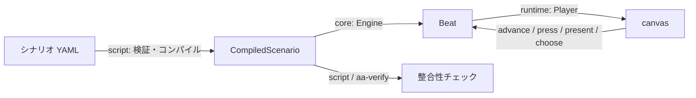

# 開発する

エンジン・プレイヤー・エディタ・ツールを直すときの資料。パッケージ管理と実行には [Bun](https://bun.sh) を使う
（Rust のツールは cargo、Python のツールは [uv](https://docs.astral.sh/uv/)）。

## コマンド

```bash
bun install
bun run dev        # player（サンプル事件「時計塔の鐘」）と editor を同時に起動（表示された URL を開く）
bun run editor     # editor だけ起動したいとき
bun run test       # テスト（Vitest。tools/convert 配下などは bun:test で書かれているので bun test も使う）
bun run typecheck  # 型チェック
bun run check apps/player/cases/clocktower.yaml   # シナリオの検証と整合性チェック
bun run schema     # エディタ補完用の JSON Schema を書き出す
bunx biome check .          # フォーマット・lint（.editorconfig 準拠、biome-plugins の GritQL ルールを含む）
bunx biome format --write . # フォーマットだけ直す
cargo build --release -p aa-verify   # 整合性チェックの Rust 版 → target/release/aa-verify
```

## 構成

```text
.
├── packages/
│   ├── core/        状態（フラグ・証拠品・ライフ）と、証言・尋問のステートマシン。描画を知らない
│   ├── script/      YAML → 中間表現のコンパイラ。zod スキーマ・参照チェック・行番号つきのエラー・整合性チェック
│   └── runtime/     canvas への描画と入力。Engine の Beat を画面にする
├── apps/
│   ├── player/      プレイヤー。サンプル事件（cases/）とデバッグパネル（フラグの書き換え・シーン移動・セーブ/ロード）
│   └── editor/      エディタ AAEditor（React + shadcn/ui）。保存は開発サーバー経由で YAML に書く
├── crates/
│   ├── aa-verify/   整合性チェックの Rust 版（既定は軽いチェック、--complete で網羅的な探索）
│   ├── aa-rom/      DS 版の ROM から素材を取り出す本体（蘇る逆転）
│   ├── aa-extract/  aa-rom のコマンド版
│   ├── aa-wasm/     aa-rom をブラウザーから使う入口
│   └── aa-ctr/      3DS 版（逆転裁判5・6）の台本・音声を取り出す
├── tools/
│   ├── convert/     元の台本を YAML の章に変換する（bun）
│   ├── rom/         ROM の解析と取り出し（Python）
│   ├── sprites/     ドット絵の生成・取り込み・チェック
│   ├── evidence/    証拠品の絵の生成
│   ├── assets/      公式の画像の数値を測る
│   └── analysis/    変換した章の集計（書き方の分析の数の出どころ）
├── schema/          scenario.schema.json（bun run schema で生成）
├── assets/          生成した絵の元画像・効果音など。extracted/（取り出したもの）と roms/ は git の対象外
└── docs/            この資料
```

- 画面は DS 版の上画面と同じ 4:3、256×192 ドット（1 ドット = 2px で描く）。
- 文字は同梱の PixelMplus12/10（M+ FONT LICENSE）で、ドット絵と同じ粗さで描く。手元に DS 版のフォントがあればそれを使う。

## データの流れ



- シナリオの形は `packages/script/src/schema.ts` の zod スキーマが唯一の正。検証・型・JSON Schema はすべてここから作る。
- エンジンの状態（`GameState`）はそのまま JSON にでき、セーブデータになる。
- 文字送りや演出の状態は runtime だけが持ち、エンジンには入れない。

## コード規約

フォーマット・lint は Biome（`biome.json`）。[qtmleap/biome-plugins](https://github.com/qtmleap/biome-plugins)
（git submodule、`biome-plugins/`）の GritQL ルールで `??` フォールバックや `as` 型アサーションなどを警告する。
既存コードの違反は残したままにしてあるので、新しく書くコードから従う。

JSON を実行時に読み込む箇所（`verify-font.ts` が読む `katakana-style.json` など）は zod で `parse` し、
型注釈だけに頼らない。

テストは各パッケージ・ツールのソースと同じ階層の `__tests__/`（例: `packages/script/src/__tests__/`）に置く。

## 関連

- [整合性チェック（Rust 版）の説明](../crates/aa-verify/README.md)
- [画面](screen.md)・[DS 版との互換性](compatibility.md)
- [絵を用意する](sprites.md)・[公式の章を遊ぶ](official-chapters.md)・[3DS 版の解析](3ds.md)
