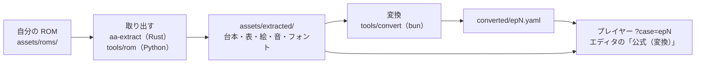

# 公式の章を遊ぶ（手元用・配布しない）

自分で吸い出した ROM から台本・絵・音・フォントを取り出し、元のゲームの章をこのエンジンで遊ぶ手順。
**取り出したものは手元でだけ使い、配布しない。** このリポジトリも公式の素材を含まない。

- ROM は `assets/roms/` に、取り出したものは `assets/extracted/` に置く（どちらも `.gitignore` 済み）。
- 対象は DS 版の 3 作の全 14 話（逆転裁判 蘇る逆転 5 話・逆転裁判2 4 話・逆転裁判3 5 話）。
- 要るもの: [Bun](https://bun.sh)・Rust の道具（[ビルド済みのものを入手できる](tools-release.md)。自分でビルドするなら cargo）・Python（[uv](https://docs.astral.sh/uv/)）。
  フォントの文字の対応を作る文字認識は macOS の Vision を使う（macOS だけ）。



## 今の状態

Rust のツール（`crates/`）だけでは、まだ遊べる所まで取り出せない。今は Rust・Python・bun を組み合わせる。

| ツール | 役目 | 今の状態 |
|---|---|---|
| `aa-extract`（`aa-rom` のコマンド版） | ROM から NitroFS のファイル・画像・机・音・フォント・台本・表を書き出す | **蘇る逆転だけ**。逆転裁判2・3 の ROM は表・台本の所で失敗する |
| `aa-rom` | 取り出しの本体（ファイルに触らず、バイト列 → バイト列） | 同上 |
| `aa-wasm` | `aa-rom` をブラウザーから使う入口 | 使う画面・ビルドの手順はまだ無い |
| `aa-ctr` | 3DS 版（逆転裁判5・6）の台本・音声を取り出す | [3DS 版の解析](3ds.md) を参照 |
| `tools/rom/`（Python） | 3 作とも取り出せる。文字認識（フォント・選択肢・法廷記録の文字）もここ | すべての手順がある |
| `tools/convert/`（bun） | 取り出した台本と表を、シナリオの YAML に変換する | 3 作の全 14 話 |

`aa-extract` に無いもの（蘇る逆転でも Python が要るもの）:

- フォントの文字の対応（`font/mapping.tsv`。macOS の文字認識で作る。無いと台本の漢字が `{NNN}` になり、ゲーム用のフォントも作られない）
- 選択肢の文、探偵パートの場所・話題の名前（文字認識。Rust の出力では空）
- 背景の描き方の表（`tables/bg_render.json`・`data/tail/bg_fixed/`）、第 5 話の遊びの表と映像（`tables/minigames.json`・`data/movie/`）、
  3D で調べる表（`tables/examine3d.json`）、下画面の UI（`ui/`）、小さい字のフォント（`font/ds-small-*`）、法廷記録の文字（`tables/record_text.json`）

## 蘇る逆転

```bash
ROM=assets/roms/GYAKUTEN_YOM_AGYJ08_00.nds

# 1. フォントの字形と文字の対応（Python。文字認識は macOS）
python3 tools/rom/dsfont.py $ROM                  # → assets/extracted/font/glyphs.txt
python3 tools/rom/ocr_font.py $ROM                # → assets/extracted/font/mapping.tsv

# 2. 素材・台本・表・音（Rust。数秒〜数十秒）
cargo build --release -p aa-extract
target/release/aa-extract $ROM --out assets/extracted --font-mapping assets/extracted/font/mapping.tsv
#   既定の出力先は assets/extracted-rs（Python 版との突き合わせ用）なので、--out を必ず付ける

# 3. Rust に無いもの（Python）
uv run tools/rom/script_json.py $ROM --ocr        # 台本の JSON を選択肢の文つきで書き直す
uv run tools/rom/tbl_invest.py $ROM --ocr         # 探偵パートの場所・話題の名前
uv run tools/rom/tbl_bg_render.py $ROM            # 背景の描き方
uv run tools/rom/tbl_minigames.py $ROM            # 第 5 話の指紋・人物の指名・映像などの表と絵
uv run tools/rom/tbl_examine3d.py $ROM            # 3D で調べる所
uv run tools/rom/ex_ui.py $ROM                    # 下画面の UI の絵
uv run tools/rom/small_font.py                    # 小さい字のフォント（法廷記録・名札）
uv run tools/rom/record_text.py                   # 法廷記録の名前・説明文（small_font.py の後）

# 4. 変換（bun）
bun tools/convert/index.ts --episode 1            # → assets/extracted/converted/ep1.yaml（2〜5 も同じ）
```

`bun run dev` でプレイヤーを開き、`?case=ep1` を付けるか章の選択から選ぶ。
取り出した絵があると、プレイヤーは DS 版の人物・背景・机・吹き出しで表示する（画面の下の「グラフィック」で切り替える。生成したドット絵にするには `?art=generated`）。
取り出した音も同じく、画面の下の「サウンド」で切り替える。**DS（原音）**（`?sound=ncsf`。NCSF で書き出した音、[下の節](#bgm効果音を-ds原音で書き出すncsf)）・
**DS（互換）**（`?sound=compat`。手順の 2. で自前の計算で書き出した音 `sound/rendered/`）・**仮の音**（`?sound=synth`）の 3 つ。
指定がなければ、書き出してあるものの中で 原音 → 互換 → 仮の音 の順に選ぶ。

この節の手順は、各スクリプトの説明とコード、`aa-extract` の出力と Python 版の出力の比べ合わせから組み立てたもの。
ROM から通しで流して確かめてはいない。

## 逆転裁判2・3

今は Python だけで取り出す（`aa-extract` は使えない）。スクリプトは ROM から作品を見分け、
`assets/extracted/aa2/`・`aa3/` に書き出す。

```bash
ROM=assets/roms/GYAKUTEN_2_A2GJ08_00.nds          # 逆転裁判3 は GYAKUTEN_3_YG3J08_00.nds・aa3

uv run tools/rom/extract_assets.py $ROM           # ファイル・画像・机・音
python3 tools/rom/dsfont.py $ROM assets/extracted/font/A2GJ
python3 tools/rom/ocr_font.py $ROM assets/extracted/font/A2GJ --base assets/extracted/font
uv run tools/rom/script_json.py $ROM --ocr        # 台本
# 表: tbl_chars・tbl_record・tbl_court・tbl_sound・tbl_anims・tbl_bg_render・tbl_invest・tbl_invest_start（どれも <rom.nds> を渡す）
uv run tools/rom/record_text.py --game aa2        # 法廷記録の文字
uv run tools/rom/record_profiles.py $ROM          # 人物ファイル
uv run tools/rom/choice_text.py --game aa2        # 選択肢の文
uv run tools/rom/sseq_render.py --sdat assets/extracted/aa2/files/sound_data.sdat --out assets/extracted/aa2/sound/rendered --no-ogg

bun tools/convert/index.ts --episode 2 --game aa2 # → assets/extracted/aa2/converted/ep2.yaml
```

プレイヤーでは `?case=aa2-ep2`・`?case=aa3-ep1` のように選ぶ。
表のスクリプトの細かい引数と出力は、各スクリプトの先頭の説明を見る。

## BGM・効果音を DS（原音）で書き出す（NCSF）

DS（互換）の音（`sound/rendered/`、`sseq_render.py`・`aa-extract`）は、DS の音源ドライバーを自前でまねて書き出したもの。
DS（原音）は、[NCSF](https://github.com/CyberBotX/NCSF)（MIT）の再生部で書き出す。NCSF の再生部は、
Pokémon Diamond の逆コンパイル（pret）にある NITRO の音源ドライバー（SND）を C# にしたもので、実機の計算にいちばん近い。

- 要るもの: .NET 10 SDK と、NCSF を clone したもの（**リポジトリの外に置く**）。先に DS（互換）を書き出しておく
  （名前・番号・長さ・ループの位置をその `index.json` から取る）。
- `tools/rom/ncsf_render.py` が `tools/rom/ncsf_render/`（NCSF の再生部を呼ぶ小さな C# の道具）をビルドして、
  すべての BGM・効果音を 32,728 Hz・補間なしで WAV にする。ループの位置は DS（互換）の値を、継ぎ目が合うように合わせ直して使う。

```bash
git clone https://github.com/CyberBotX/NCSF ~/src/NCSF       # 場所はどこでもよい（リポジトリの外）
uv run tools/rom/ncsf_render.py --ncsf ~/src/NCSF             # → assets/extracted/sound/ncsf/（数十秒）
uv run tools/rom/ncsf_render.py --ncsf ~/src/NCSF --game aa2  # 逆転裁判2（aa3 も同じ）→ assets/extracted/aa2/sound/ncsf/
#   dotnet が PATH に無ければ --dotnet /path/to/dotnet。一部だけなら --only BGM013,SE010
```

DS（互換）との違い（2026-09 に 蘇る逆転 の BGM004・BGM010・BGM013・SE010 を、トラックごとにも比べた）:

- **PSG（矩形波）の音が 9 半音（長 6 度）高い。** NCSF（pret）は PSG の基準を タイマー 8006（261.6 Hz = キー 60）にしているが、
  自前は 440 Hz を基準にしている（`crates/aa-rom/src/sound/channel.rs` の `PSG_BASE_TIMER`・`tools/rom/sseq_channel.py` の同名）。
  バンクの PSG の音色の基準のキーはすべて 60 なので、NCSF の方が合っている。ノイズの基準も同じ値を使う。
- **シーケンスの音量（SDAT の INFO の値）の効き方が強すぎる。** 自前は 2 乗の表（`cnv_sust`）で変換するが、
  NCSF はデシベルの表（`SND_CalcDecibel` に当たる）を使う。音量 127 の曲は同じで、95 の SE010 は約 2.7 dB、110 の BGM004 は約 1.4 dB 小さい
  （`crates/aa-rom/src/sound/player.rs` の `seq_vol: cnv_sust(seq_vol)`）。
- ほかは、PCM の音色・音程・テンポ・包絡線・パンはほぼ同じ（PCM のトラックは標本単位で相関 0.96〜1.00、音量の差 0.1 dB 程度）。
  自前は音が 1 フレーム（5.2 ms）遅れて出る。BGM004 の一部の音で、自前は離鍵の後の余韻（約 60 ms）が切れる。

## DS 版のフォント

プレイヤーは `assets/extracted/font/` に DS 版の本文フォントがあればそれを使い、無ければ同梱の PixelMplus12 で表示する。
上の手順の 1. と 2. で作られる。DS 版に無い漢字は、部品から組み立てて足せる。

```bash
python3 tools/rom/compose.py 'apps/player/cases/*.yaml'   # DS 版に無い漢字を部品から作る → tools/rom/font_extra.draft.txt
python3 tools/rom/build_font.py                           # ゲームで使う形に書き出す → assets/extracted/font/ds-font.png / ds-font.json
```

逆転裁判2・3 の ROM があれば、蘇る逆転に無い字をそこから足せる（2・3 は同じ画風のフォント）。

```bash
python3 tools/rom/build_font.py assets/extracted/font --also assets/extracted/font/YG3J assets/extracted/font/A2GJ
```

| ファイル | 中身 |
|---|---|
| `tools/rom/font_fixes.tsv` | 文字認識の結果を、字形を目で見て直したもの（ほかの作品の分は `font_fixes.<フォルダ名>.tsv`） |
| `tools/rom/font_extra.txt` | DS 版に無い字（下書きを確かめて手直ししたもの）。`font_parts.txt` は手で描いた部品 |
| `tools/rom/data/ids.txt` | 漢字の部品の組み立て（cjkvi-ids、CHISE 由来、GPLv2） |

比較用のページ `apps/player/compare.html` で、DS 版のスクリーンショットと点の単位で見比べられる。

## 関連

- [DS 版との互換性](compatibility.md): 取り出した素材で描いた画面と DS 版の比較
- [公式の画像の仕様](official-assets.md): 背景・人物・机・フォントなどの大きさ・色数・置き方（数値だけ）
- [3DS 版の解析](3ds.md): 逆転裁判5・6 の台本・音声
