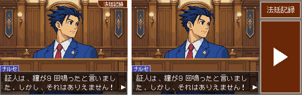
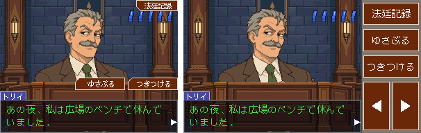

# 画面

画面は DS 版のメイン画面（上画面）と同じ **4:3、256×192 ドット**。1 ドットを 2px で描く。
自作のシナリオも、公式の章（元の台本から変換した章）も、この大きさで遊ぶ。
PC やタブレットの横長の画面向けに、右にボタンの欄を足した 16:9 も選べる（試験的）。
シナリオの YAML には画面の大きさを書かない。

## DS 版の 2 画面を 1 画面にまとめる

DS 版は上下 2 画面で、下画面にボタン（「法廷記録」「ゆさぶる」「つきつける」、選択肢、探偵メニューなど）がある。
このプレイヤーは 1 画面なので、4:3 では下画面のボタンを上画面に重ねて描く（16:9 では右の欄に並べる。下の「16:9」）。

| DS 版の下画面 | このプレイヤー |
| --- | --- |
| 「法廷記録」ボタン | 画面の右上に小さく出す |
| 「ゆさぶる」「つきつける」 | 尋問中、テキストウィンドウの上の右に出す |
| 選択肢のボタン | 画面の上の方に重ねる（DS 版の上画面は暗くなり「ぼくのコタエを示そう」の帯が出るが、それは描かない） |
| 探偵メニュー・移動先・話題の一覧 | 画面に重ねる |
| 法廷記録（一覧・詳細） | 画面を法廷記録に切り替え、DS 版の下画面の座標のまま描く |

操作はマウス（クリック）とキーボード。DS 版の見た目との比べ方は [compatibility.md](compatibility.md)。

## 調べる所の目印

探偵パートの「調べる」で、調べられる範囲に目印を出せる（サンプルのプレイヤーの「調べられる所に目印を出す」、
AAEditor のプレビュー）。DS 版には無い、作る人向けの補助。

## 16:9: 右にボタンの欄（試験的）

PC やタブレットの横長の画面向けに、16:9（342×192 ドット）を選べる。**試験的な機能**で、既定は 4:3。
左の 256×192 は 4:3 と同じ画面（DS 版の上画面そのまま）で、何も重ねない。右の 86 ドットの欄に、
DS 版で下画面にあったボタンを DS 版と同じ 80×32 ドットで縦に並べる。操作はマウスでもタッチでもよい。

- **Player**（`@gyakusai/runtime`）: `new Player({ ..., aspect: '16:9' })`。幅は `screenWidth(aspect)`。
- **サンプルのプレイヤー**: 画面の下の欄の「画面の幅」、または URL の `?aspect=16:9`。
- **AAEditor**: プレビューの上の「画面: 4:3 / 16:9」。

欄の中身は場面で変わる（`packages/runtime/src/panel.ts`）。一番上はいつも「法廷記録」（開けるときだけ）。

| 場面 | 右の欄 |
| --- | --- |
| 会話・日時と場所の表示・証言 | 大きな ▶（画面をクリックしても進む） |
| 尋問 | 「ゆさぶる」「つきつける」と、前後の証言へ移る ◀ ▶ |
| 証拠品をつきつけるよう求められたとき | 「つきつける」（サイコ・ロックでは「やめる」も） |
| 探偵パートのメニュー | 「調べる」「移動する」「話す」「つきつける」 |
| 調べる・移動先や話題の一覧 | 「もどる」（横長の背景では、背景を動かすボタンも） |
| 範囲を選ぶ | 「やめる」、絵が何枚かあれば早戻し・早送り |
| 法廷記録を開いている間 | 何も出さない（法廷記録は DS 版の下画面の座標のまま画面に重ねる） |

選択肢と、移動先・話題の一覧は字が長くて欄に入らないので、4:3 と同じく画面に重ねる。
ボタンを重ねないので、ライフの「！」は DS 版と同じ右上に出す（4:3 では「法廷記録」のボタンの下にずらしている）。

サンプルの章「時計塔の鐘」の会話と尋問。左が 4:3、右が 16:9（どちらも等倍）。
画像は `apps/player/aspect-doc.html?shot=<名前>` で描ける（名前は `src/aspect-doc.ts` の `SHOTS`）。

16:9 を直すときに 4:3 の見た目が変わっていないかは、`apps/player/aspect-check.html` で確かめる。
変更の前に「今の結果を基準として保存」を押し、変更の後に開き直すと、4:3 の画面の画素のハッシュが違う場面を赤で示す
（`?cases=clocktower,ep1` で章を、`?max=150` で章ごとの場面の数を、`?wide=0` で 16:9 の絵を省く）。
