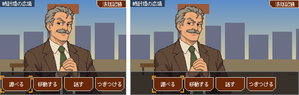
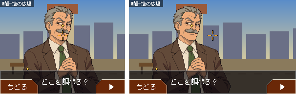
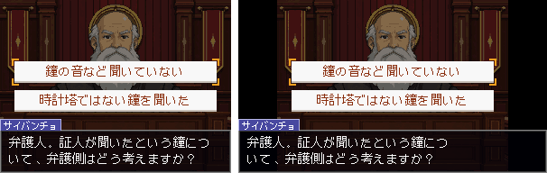
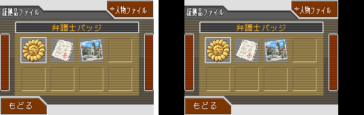
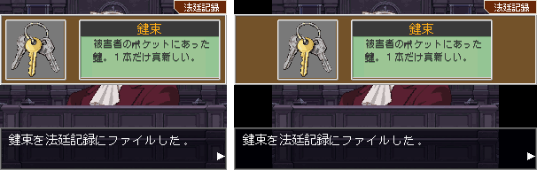
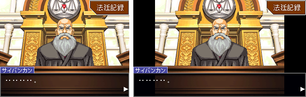
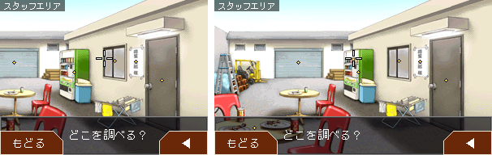

# 画面の幅（4:3 と 16:9）

画面の横幅は 2 つから選べる。

| 幅 | 大きさ（ドット） | 使い方 |
| --- | --- | --- |
| 4:3（既定） | 256×192 | DS 版と同じ。今は自作のシナリオも公式の章もこちらで遊ぶ |
| 16:9 | 342×192 | 選べば使える。192×16/9 ≈ 341.3 を偶数にした幅で、4:3 の枠を中央に置くと左右に 43 ドットずつ空く |

## 設定の仕方

- **Player**（`@gyakusai/runtime`）: `new Player({ ..., aspect: '16:9' })`。書かなければ `'4:3'`。
  幅は `screenWidth(aspect)` で分かる。`fitCanvas` は canvas の大きさを読むので、どちらの幅でもそのまま使える。
- **サンプルのプレイヤー**（`apps/player`）: 画面の下の欄の「画面の幅」で選ぶ。URL の `?aspect=16:9` でも選べる。
- **AAEditor**: プレビューの上の「画面: 4:3 / 16:9」で切り替える（このブラウザに覚える。既定 4:3）。
  切り替えても遊んでいる状態は続く。「調べる」の範囲の編集の点線（スクロールの端で見える窓の境目）も、選んだ幅に合わせる。

シナリオの YAML には書かない（どの章も、どちらの幅でも遊べる）。

## 16:9 での置き方

DS 版の座標（256 ドット幅）で決めた部品を、画面の左・右・中央のどこかに寄せる。

| 部品 | 置き方 |
| --- | --- |
| テキストウィンドウ | 画面の幅いっぱい。本文と名札は左寄せ（1 行の文字数は 4:3 と同じ）、文字送りの ▶ は右寄せ |
| 「法廷記録」「ゆさぶる」「つきつける」、ライフ（「！」とゲージ） | 右寄せ |
| 選択肢・探偵メニューのボタン・サイコ・ロックの錠・「証言開始」などの大きな文字・吹き出し | 中央 |
| 「もどる」「やめる」・場所の名前・「証言中」・証拠品の小窓 | 左寄せ（右に出す小窓は右寄せ） |
| 背景を動かすボタン・絵の早戻し／早送り | 右寄せ |
| 証拠品を入手したときの窓 | 枠は画面の幅いっぱい、中の札は中央 |
| 法廷記録 | 4:3 の枠を中央に置き、DS 版の下画面の座標のまま描く。左右は黒で埋める |
| 人物を選ぶ画面・範囲を選ぶ絵 | 4:3 の枠を中央に置く（左右は黒） |

### 背景・立ち絵・演出

- 立ち絵・机・重ね絵・「異議あり！」の絵は、4:3 の枠の座標で描く（立ち絵の基準点は画面の中央、x 171）。
- 256 ドット幅以下の背景（公式の背景のほとんど）は、中央に置いて左右を黒にする。
- 画面より広い背景は、見える幅いっぱいに見せる。最初の位置は、4:3 の画面の中央に見えていた所が中央に来るようにずらし、
  背景の端を越えないように詰める。人物は背景の同じ所に来る（詰めたときは、中央から少しずれる）。
- 台本のスクロールと「調べる」で背景を動かす範囲は、見える幅で端を決める。
- 法廷の視点の流しは、人物と机を 4:3 と同じく中央の基準で動かし、全景を見える幅だけ広げて描く。
- 揺れ・フラッシュ・フェード・白黒は画面全体にかかる。

### 調べる・範囲を選ぶ

調べる範囲は背景の座標なので、画面の幅で変わらない。16:9 では、狭い背景の左右の黒い所は調べられない
（カーソルも入らない）。そのため、調べられる点は 4:3 と同じになり、整合性チェック（`verify`・`aa-verify`）の結果も
画面の幅によらない。

## 見え方の比較

左が 4:3、右が 16:9（どちらも等倍）。サンプルの章「時計塔の鐘」を、生成したドット絵で描いたもの。
広場の背景は、比較のために描いた横長（512×192）の仮の絵。

| 場面 | 4:3 ／ 16:9 |
| --- | --- |
| 会話 |  |
| 尋問 |  |
| 探偵メニュー |  |
| 調べる |  |
| 選択肢 |  |
| 法廷記録 |  |
| 証拠品の入手 |  |

公式の章（元の台本から変換した章）での見え方。

| 場面 | 4:3 ／ 16:9 |
| --- | --- |
| 法廷の会話 |  |
| 横長の背景を調べる |  |

公式の章の画像の背景・人物・部品の絵は「逆転裁判」シリーズ（© CAPCOM）のもの。見え方の説明のために載せている。

画像は `apps/player/aspect-doc.html?shot=<名前>` を開くと描ける（名前は `src/aspect-doc.ts` の `SHOTS`）。

## 4:3 が変わっていないことの確かめ方

`apps/player/aspect-check.html` を開く（`bun run dev` のプレイヤーのサーバーで）。

1. 変更の前に開き、「今の結果を基準として保存」を押す（このブラウザに覚える）。
2. 変更の後にもう一度開くと、4:3 の画面の画素のハッシュを基準と比べ、違う場面を赤で示す。

各章のシーンの始めの場面と、決まった手順の場面（視点の流し・証拠品の入手・サイコ・ロック・ゲージ・範囲を選ぶ・
横長の背景を調べる・法廷記録）を、決まった時刻と乱数で描く。16:9 で描いた絵も並べて出す。
`?cases=clocktower,ep1` で章を、`?max=150` で章ごとの場面の数を、`?wide=0` で 16:9 の絵を省く。
