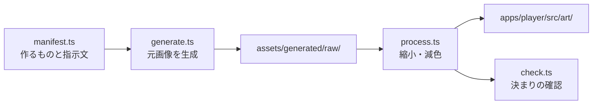

# 絵を用意する

人物・背景・机・証拠品のドット絵を作り、プレイヤーに取り込む手順。
絵の置き場所は `apps/player/src/art/`（人物は `character/<人物ID>.png` と口を開けた `<人物ID>-talk.png`、
背景・机は `background/`・`foreground/` の `<立ち位置>.png`、証拠品は `evidence/<証拠品ID>-64.png`・`-32.png`）。
まだ画像が無いものは、コードで描いた仮の絵（`apps/player/src/placeholder-art.ts`）か、何も描かずに進む。

## 決まり

| 資料 | 中身 |
|---|---|
| [立ち絵の仕様](../tools/sprites/SPEC.md) | キャンバス・色数・輪郭・動き・差分コマ・スプライトシート・取り込むときの減色 |
| [立ち位置の仕様](../tools/sprites/STAND_SPEC.md) | 弁護側・検察側・証人などの立ち位置ごとの置き方 |
| [公式の画像の仕様](official-assets.md) | DS 版の背景・机・吹き出し・証拠品・フォントなどの大きさ・色数・形式・置き方（数値だけ） |

減色は人物・背景・机・証拠品とも 1 枚 15 色 + 透明、15 ビット色、ディザなし。人物は 1 人の全コマで 1 枚のパレットを共有し、
差分コマはベースで使った色だけで描く。

## 画像生成で作る

作るものの一覧と指示文は `tools/sprites/manifest.ts` にある。画像生成は Codex CLI の組み込み画像生成を使う
（人物・机・証拠品は透過）。



```bash
bun tools/sprites/generate.ts            # まだ無い元画像を生成（種類ごとに並列）→ assets/generated/raw/
bun tools/sprites/generate.ts evidence   # 種類を指定（character / background / foreground / evidence）
bun tools/sprites/process.ts             # 画面用のドット絵に縮め、DS の色の決まりに減色して apps/player/src/art/ に取り込む
```

- 画像生成は Codex の利用枠を消費する（画像のあるやり取りは通常の 3〜5 倍の速さで減る）。
- 人物は口パク用に、口を開けた絵（`<人物ID>-talk.png`）も作る。

## 決まりを守っているか確かめる

生成した立ち絵は、決まりを守っているかを機械で確かめる（`process.ts` の最後にも自動で走る）。
手で描いた絵も、`apps/player/src/art/character/` に置けば同じように確かめられる。

```bash
bun tools/sprites/check.ts               # 色数・透過・アンチエイリアス・差分コマの範囲の外の変化・ずれ → assets/generated/check/
bun tools/sprites/check.ts naruse --fix  # だめな差分コマを直したものも書き出す（元は残す）
bun tools/sprites/sheet.ts make naruse   # 差分コマをまとめて描かせるスプライトシートと指示文
bun tools/sprites/sheet.ts cut naruse <生成されたシート.png>   # 切り分けて位置を合わせ、確かめる
```

仕様の数値の根拠（DS 版のコマの統計）は `uv run python tools/sprites/measure_official.py` で測り直せる（手元の取り出したデータが要る。
[公式の章を遊ぶ](official-chapters.md)）。
