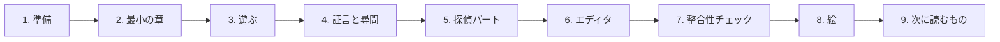
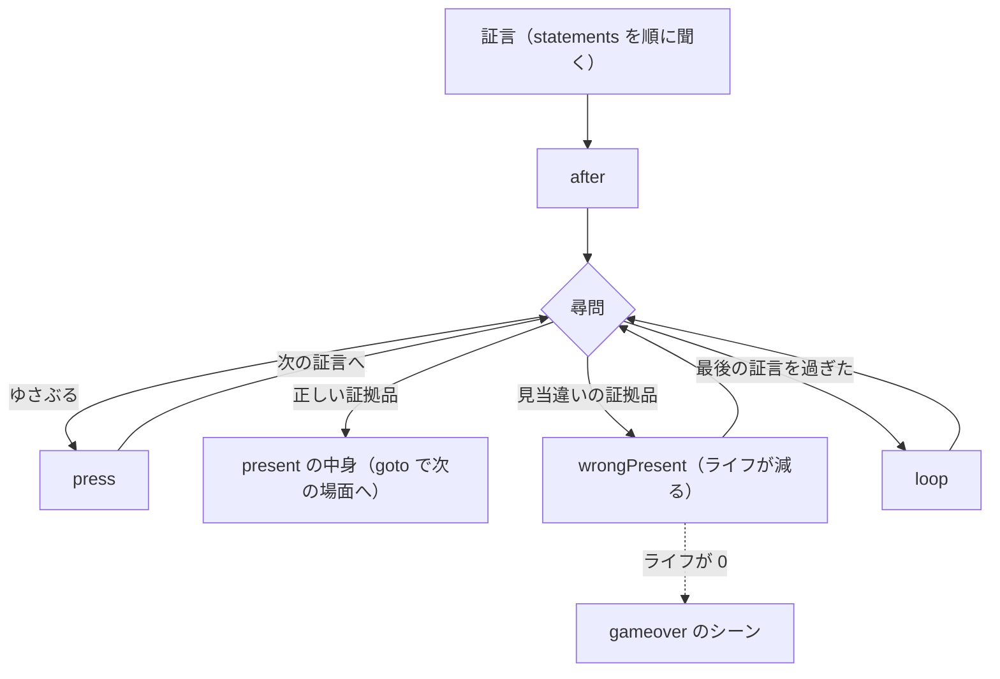
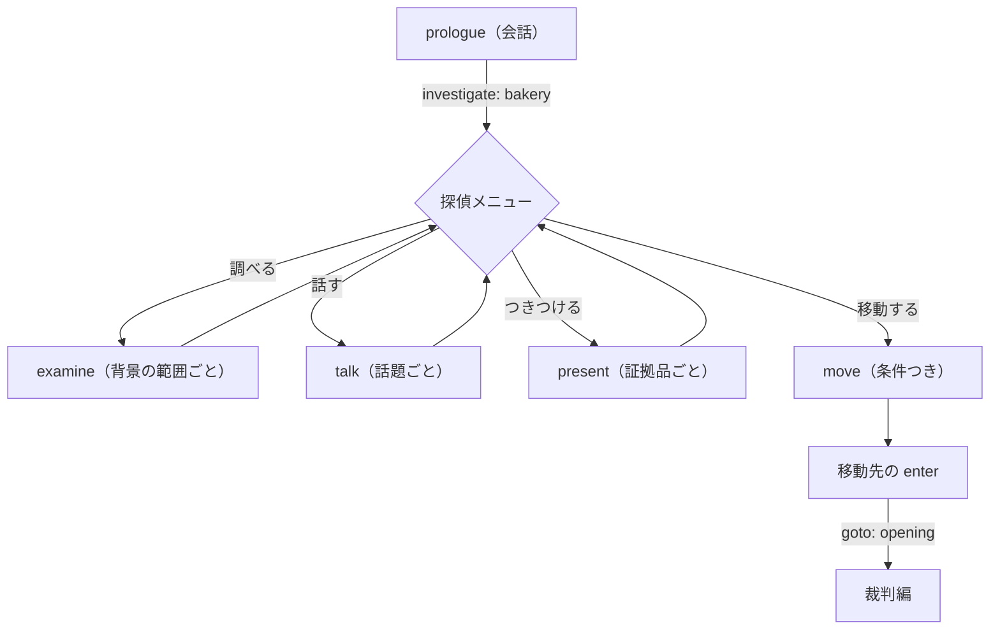

# はじめてのシナリオ

自作の小さな事件「パン屋の夜」を、はじめから終わりまで作ってみる。
順に進めると、会話 → 裁判（証言と尋問）→ 探偵パートのある 1 章ができあがる。

- 対象: このリポジトリを初めて使う人。YAML は「インデントで入れ子を表す書き方」とだけ分かっていればよい。
- 完成した章: [パン屋の夜（完成形の YAML）](tutorial/bakery.yaml)。各段の YAML は、どれもそのままコンパイルと整合性チェックを通る。
- 書き方の全部は [シナリオの書き方](scenario.md) にある。ここでは必要な所だけ使う。



## 1. 準備

[Bun](https://bun.sh) を入れてから、リポジトリの直下で次を実行する。

```bash
bun install
bun run dev    # プレイヤーとエディタを同時に起動する（表示された 2 つの URL を開く）
```

プレイヤーでは、サンプル事件「時計塔の鐘」が始まる。クリックか Enter で進み、X で法廷記録を開く。
止めるときは Ctrl+C。

## 2. 最小の章を作る

1 つの YAML ファイルが 1 つの章（事件）になる。`apps/player/cases/bakery.yaml` を作り、次を書く。

```yaml
# yaml-language-server: $schema=../../../schema/scenario.schema.json
id: bakery                 # 章の ID（セーブデータの区別に使う）
title: パン屋の夜
player: minato             # 主人公（「異議あり！」を言う人）

characters:                # 人物: ID → 名前と立ち位置
  minato:
    name: ミナト
    stand: defense         # defense（弁護側）/ prosecution（検察側）/ witness（証言台）/ judge（裁判長）
  kurosaki:
    name: クロサキ
    stand: prosecution
  judge:
    name: サイバンチョ
    stand: judge

evidence:                  # 証拠品: ID → 名前と説明
  badge:
    name: 弁護士バッジ
    description: 弁護士である証。いつも胸につけている。

start:
  scene: opening           # 最初のシーン
  evidence: [badge]        # 最初から持っている証拠品

scenes:
  opening:
    - card: "10月3日 午前10時\n地方裁判所 第1法廷"
    - judge: 小麦 太一の審理を始めます。
    - minato: 弁護側、いつでも始められます。
    - kurosaki: 検察側も、とうに。
    - minato: （初めての法廷だ。落ち着いていこう）
    - end: true
```

- `- 人物ID: 台詞` で、その人物が話す。`（ ）` で始めると心の声（青字）になる。
- `card` は日時と場所の表示。`\n` で改行する（`"..."` で囲む）。
- `end: true` でクリアになる。
- 先頭の `$schema` の行があると、VS Code の YAML 拡張で補完と検証が効く。

書いたら確かめる。

```bash
bun run check apps/player/cases/bakery.yaml
# → apps/player/cases/bakery.yaml: OK（シーン 2、証拠品 1、フラグ 0、……）
```

## 3. プレイヤーで遊ぶ

プレイヤーの章の一覧は `apps/player/src/cases.ts` にある。サンプルの行の隣に 2 行足す。

```ts
import bakery from '../cases/bakery.yaml?raw';

export const CASES: CaseEntry[] = [
  { id: 'clocktower', label: 'サンプル: 時計塔の鐘', game: 'aa1', load: async () => clocktower },
  { id: 'bakery', label: 'パン屋の夜', game: 'aa1', load: async () => bakery },
  // ……
];
```

プレイヤーの URL の後ろに `?case=bakery` を付けて開く（画面の下の章の選択からも選べる）。
YAML を保存すると、開いているページが読み直される。

この章の人物・背景の絵はまだ無いので、画面には描かれない（台詞・証言・法廷記録は出るので、遊ぶことはできる）。
絵は [8. 絵を用意する](#8-絵を用意する) で足す。

## 4. 証言と尋問を足す

裁判の山場は、証言の中の矛盾に証拠品を「つきつける」所。流れは次のとおり。



2. の YAML に、次を足す（変えた所だけ）。

```yaml
life: 5                    # ライフの最大値

defaults:
  penalty: 1               # penalty: true で減る量
  autoPause: true          # 句読点のあとで少し待つ（手書きのシナリオ向け）
  wrongPresent:            # 見当違いの証拠品をつきつけたとき
    - judge: その「{evidence}」が、どう関係するのですか？
    - penalty: true

characters:
  # minato・kurosaki に profile（法廷記録の人物ファイル）を付け、証人を足す
  yamabuki:
    name: ヤマブキ
    stand: witness
    profile: { name: 山吹 ちよ, age: 61, description: パン屋の向かいに住む証人。 }

evidence:
  receipt:
    name: カギ屋の領収書
    description: 事件の日の午後5時に、店の表のカギを取り替えた。

flags:                     # フラグ名: 初期値
  asked_key: false

start:
  scene: opening
  evidence: [badge, receipt]   # この段では、最初から持たせておく

gameover: guilty           # ライフが尽きたときのシーン
```

`scenes` は、`opening` の最後の `end: true` を消して、続きを書く。
会話シーンの最後に `goto` が無ければ、次に書いたシーン（ここでは `t1`）へ進む。

```yaml
scenes:
  opening:
    - card: "10月3日 午前10時\n地方裁判所 第1法廷"
    - judge: 小麦 太一の審理を始めます。
    - minato: 弁護側、いつでも始められます。
    - kurosaki: 検察側も、とうに。
    - kurosaki: 被告人は、夜のパン屋から売上を盗んだ。
    - kurosaki: 見ていた人がいる。証人、入りたまえ。
    - show: yamabuki
    - judge: では証人。見たことを証言してください。

  t1:
    testimony: 事件の夜に見たこと     # 証言の題
    witness: yamabuki
    statements:
      - id: time
        text: 夜の10時ごろ、窓から外を見たんです。
        press:                     # ゆさぶったとき
          - minato: 10時だと、なぜ分かるんですか？
          - yamabuki: ちょうど時報が鳴りましたからね。
      - id: key
        text: 太一くんが、自分のカギで表の扉を開けていました。
        press:
          - minato: 本当に、カギで開けたんですか？
          - yamabuki: ええ。カチリと音がしましたよ。
          - set: { asked_key: true }
        present:                   # 証拠品 ID → つきつけたとき
          receipt:
            - goto: contradiction
    after:
      - judge: 弁護人。尋問を始めてください。
    loop:
      - minato: （どこかに、おかしな所があるはずだ）
      - if: asked_key              # ゆさぶって話を聞いていたら、ヒントを出す
        then:
          - minato: （カギの話‥‥。何か、引っかかる）

  contradiction:
    - minato: 証人。その夜、太一くんのカギでは、扉は開きません！
    - yamabuki: えっ？
    - minato: 店の表のカギは、その日の午後5時に取り替えられていたんです。
    - showEvidence: receipt
    - kurosaki: ‥‥なんだと。
    - judge: 証人の話は、信用できないようですね。
    - judge: 被告人、小麦 太一に無罪を言い渡します。
    - banner: 無罪
    - end: true

  guilty:
    - judge: 被告人に、有罪を言い渡します。
    - gameover: true
```

- 「待った！」「異議あり！」の吹き出しは、ゆさぶり・つきつけの前に自動で入る。
- 尋問では ←→ で証言の前後、Z でゆさぶる、X の法廷記録で証拠品を選んでつきつける。
- 証言の書き方の細部（隠れた証言・人物ファイルのつきつけなど）は [シナリオの書き方](scenario.md#シーン)。

## 5. 探偵パートを足す

裁判の前に、現場を調べて証拠品を手に入れる探偵パートを置く。章を「編」（`parts`）に分け、
探索編（`investigation`）と裁判編（`trial`）を順に並べる。探索編では、場所ごとに探偵メニューが出る。



トップレベルの `scenes:` を `parts:` に置き換え、4. のシーンは裁判編の `scenes` の下へ（インデントを 4 つ下げて）移す。
証拠品 `receipt` は探偵パートで拾うので、`start` から外して、最初のシーンを `prologue` にする。

```yaml
start:
  scene: prologue
  evidence: [badge]

parts:
  - id: investigation
    kind: investigation
    title: 探偵パート（10月2日）
    scenes:
      prologue:
        - card: "10月2日 午後3時\nパン屋「こむぎ」"
        - minato: （明日は、初めての法廷だ）
        - minato: （現場のパン屋を、この目で見ておこう）
        - investigate: bakery          # 場所 bakery の探偵メニューへ
    places:
      bakery:
        name: パン屋「こむぎ」
        person: yamabuki               # この場所にいる人物（話す・つきつけるの相手）
        enter:                         # 来るたびに実行する
          - if: not visited(bakery)
            then:
              - yamabuki: おや、太一くんの弁護士さんかい。
        examine:                       # area は背景の上の [x, y, 幅, 高さ]（画面は 256×192）
          - id: door
            name: 表の扉
            area: [96, 40, 64, 100]
            then:
              - minato: （表の扉だ。カギが、やけに新しい）
          - id: counter
            name: レジの台
            area: [16, 110, 80, 50]
            then:
              - minato: （レジの台だ。紙が一枚、置いてある）
              - if: not has(receipt)
                then:
                  - give: receipt
                  - narrate: カギ屋の領収書を法廷記録にファイルした。
        talk:
          - id: night
            topic: 事件の夜のこと
            then:
              - yamabuki: 10時ごろ、太一くんが入っていくのを見たよ。
              - yamabuki: 自分のカギで、扉を開けてね。
        present:
          receipt:
            - yamabuki: カギを取り替えた？　知らなかったねえ。
        move:
          - to: court
            when: has(receipt) and seen(night)   # 領収書を拾い、話を聞いたら行ける
      court:
        name: 地方裁判所
        enter:
          - minato: （よし。明日に備えよう）
          - goto: opening

  - id: trial
    kind: trial
    title: 法廷パート（10月3日）
    scenes:
      opening:
        # ……4. の opening・t1・contradiction・guilty をここへ
```

- `visited(場所)`・`seen(調べる所や話題の ID)`・`has(証拠品)` は条件式で使える（[条件式](scenario.md#条件式)）。
- 場所の背景は `background` に背景のキーを書く（省くと場所の ID）。場所の書き方の全部は [場所（探索編）](scenario.md#場所探索編)。

## 6. エディタ（AAEditor）で編集する

YAML を手で書く代わりに、フォームで編集できる。

```bash
bun run editor     # エディタだけ起動する（bun run dev でも起動している）
```

- 左上の「章」で `サンプル: bakery.yaml` を選ぶ（`apps/player/cases/` の YAML が並ぶ）。「新規」で新しい章を作れる。
- 左の一覧: 基本情報・人物・証拠品・フラグと、編ごとのシーン・場所。検索欄で台詞・ID・話し手を探せる。
- 中央: 選んだものの入力欄。台詞などのステップは並べ替え・追加ができる。
- 右: プレビュー（その場で遊べる）・整合性チェック・診断。「状態を保って移る…」で好きなシーンへ飛べ、
  ステップの「ここから再生」でその場面から遊べる。
- ⌘S（Ctrl+S）で YAML に保存する。

## 7. 整合性チェック

`bun run check` は、書き方の誤りに加えて、選べる操作をすべて試して「最後まで遊べるか」を調べる。

```bash
bun run check apps/player/cases/bakery.yaml --check-font --check-fit
```

- `--check-font`: DS 版のフォントに無い字を報告する。たとえば「鍵」は無いので、言い換えの候補「カギ」が出る
  （この章で「カギ」と書いているのはそのため）。詳しくは [カタカナの表記](katakana.md)。
- `--check-fit`: 画面の枠に収まらない文を報告する（[文字数の決まり](writing/text-length.md)）。

試しに、5. の `- give: receipt` の行を消すと、領収書が手に入らなくなり、次のように報告される。

```text
bakery.yaml: エラー: どう遊んでもクリア（end）にたどり着けません
bakery.yaml:bakery エラー: 詰み: 探索編の「パン屋「こむぎ」」から先へ進めません（……）
bakery.yaml:opening 警告: シーン「opening」には、どう遊んでもたどり着きません
```

大きな章では、Rust 版（aa-verify）が速い。

```bash
cargo build --release -p aa-verify
target/release/aa-verify apps/player/cases/bakery.yaml              # 軽いチェック（すぐ終わる近似）
target/release/aa-verify --complete apps/player/cases/bakery.yaml   # 網羅的に調べる
bun run check --engine rust apps/player/cases/bakery.yaml           # bun run check から Rust 版を使う
```

何を調べるかは [整合性チェック](scenario.md#整合性チェック) と [整合性チェック（Rust 版）の説明](../crates/aa-verify/README.md)。

## 8. 絵を用意する

サンプル事件の人物などにはコードで描いた仮の絵があるが、自作の章の人物・背景・証拠品には絵が無い。
自分の絵を使うときは、次の名前で PNG を置く。

| 種類 | 置き場所 |
|---|---|
| 人物 | `apps/player/src/art/character/<人物ID>.png`（口を開けた絵は `<人物ID>-talk.png`） |
| 背景・机 | `apps/player/src/art/background/<立ち位置>.png`・`apps/player/src/art/foreground/<立ち位置>.png` |
| 証拠品 | `apps/player/src/art/evidence/<証拠品ID>-64.png`・`<証拠品ID>-32.png` |

立ち絵は DS 版に合わせた決まり（256×192 のキャンバス・1 枚 15 色・透過・基準点など）がある。
決まりは [立ち絵の仕様](../tools/sprites/SPEC.md) と [立ち位置の仕様](../tools/sprites/STAND_SPEC.md)、
守れているかは次のチェッカーで確かめる。

```bash
bun tools/sprites/check.ts minato    # 色数・透過・アンチエイリアス・差分コマのずれなど
```

画像生成で作る手順と、取り込み（減色）の道具は [絵を用意する](sprites.md)。

## 9. 次に読むもの

- [シナリオの書き方](scenario.md): YAML の書き方の全部（ステップの一覧・台詞の途中の演出・音）
- [遊びの書き方](scenario-games.md): サイコ・ロック・証拠品を詳しく調べる・範囲を選ぶ・人物を選ぶ
- [書き方の分析](writing/README.md): 公式の 3 作を数えた文量・演出・構成の型。
  [裁判パートの書き方](writing/trial/README.md)・[探偵パートの書き方](writing/investigation/README.md) は、事件の設計から順に進むガイド
- [文字数の決まり](writing/text-length.md): 1 行 16 字 × 2 行など、枠ごとの上限と目安
- [人物の話し方](characters/README.md): 公式の人物ごとの一人称・語尾・口ぐせ（自作の人物を作るときの参考）
- [カタカナの表記](katakana.md): 逆転裁判らしいカタカナの使い分けと、使える漢字
